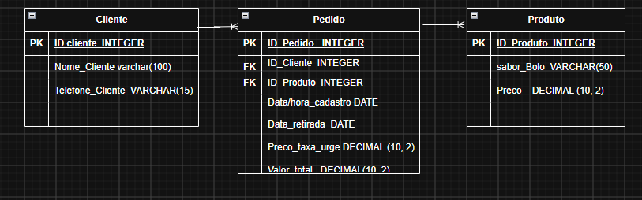

## Bolos da Neide

### Introdução
A Bolos da Neide trabalha com encomendas de bolos. O objetivo do sistema é permitir o cadastro, armazenamento e consulta das encomendas, facilitando o controle dos pedidos e seus respectivos valores.

## Entidades
As entidades do nosso banco de dados seriam: 

-> Cliente
-> Produto
-> Pedido

## atributos

-> Cliente:

• ID do Cliente: Número de identificação único gerado automaticamente 
• Nome Completo
• Telefone de Contato

-> Produto:

• ID do Produto: Número de identificação único do sabor
• Sabor: Nome do sabor do bolo 
• Preço Base: O valor padrão cobrado por aquele bolo

-> Pedido

• ID do Pedido
• ID do Cliente
• ID do Produto
• Data/hora do Cadastro
• Data/hora da retirada do pedido
• Preço da taxa de urgência (se houve)
• Valor total do pedido

## Relacionamento

-> O realcionamento entre as entidades é de 1 para N, ou seja, 1 para muitos, pois um cliente consegue fazer diversos pedidos, e um sabor de bolo pode também estar em vários pedidos diferentes.

**Cliente:** Dona Neide - Bolos da Neide.

